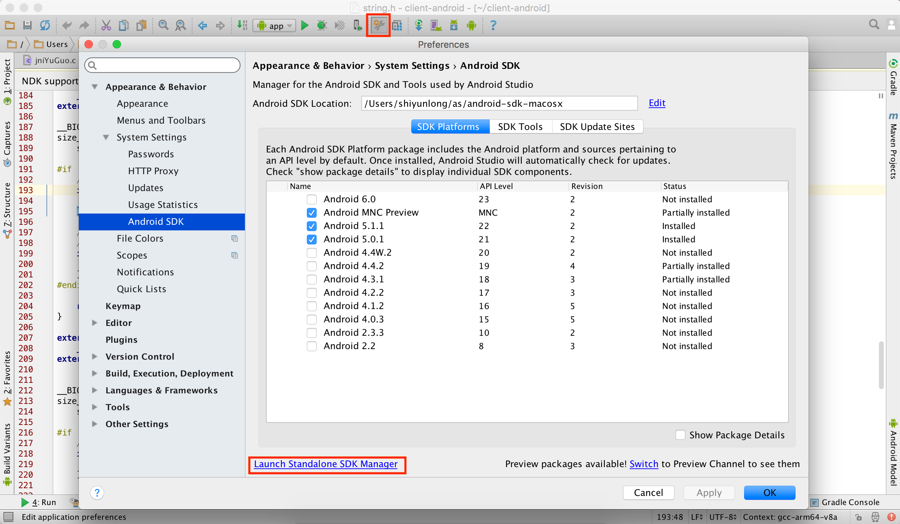
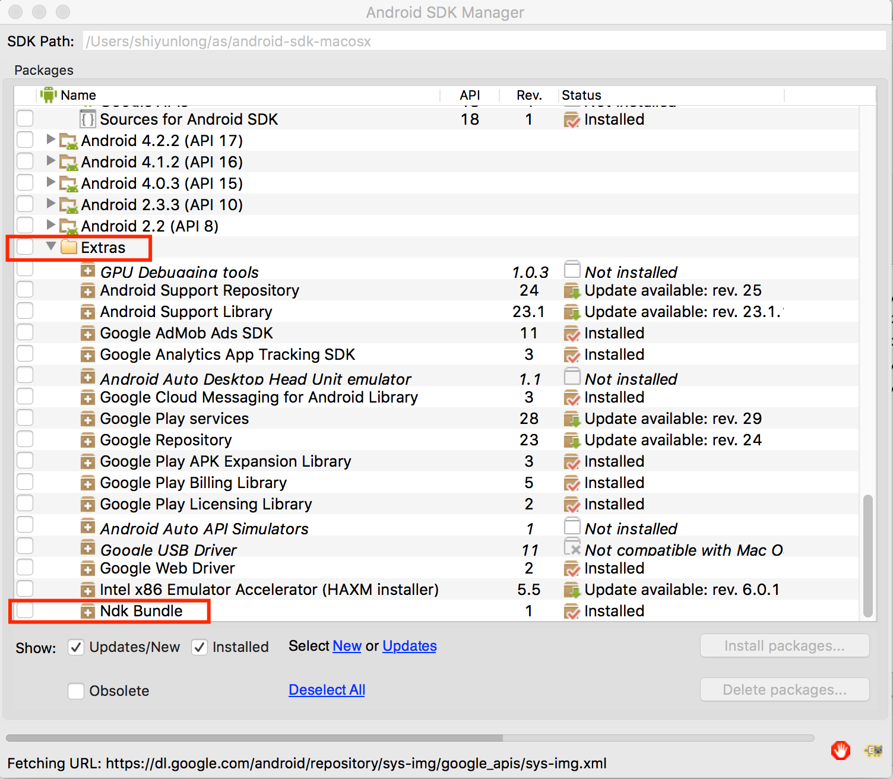
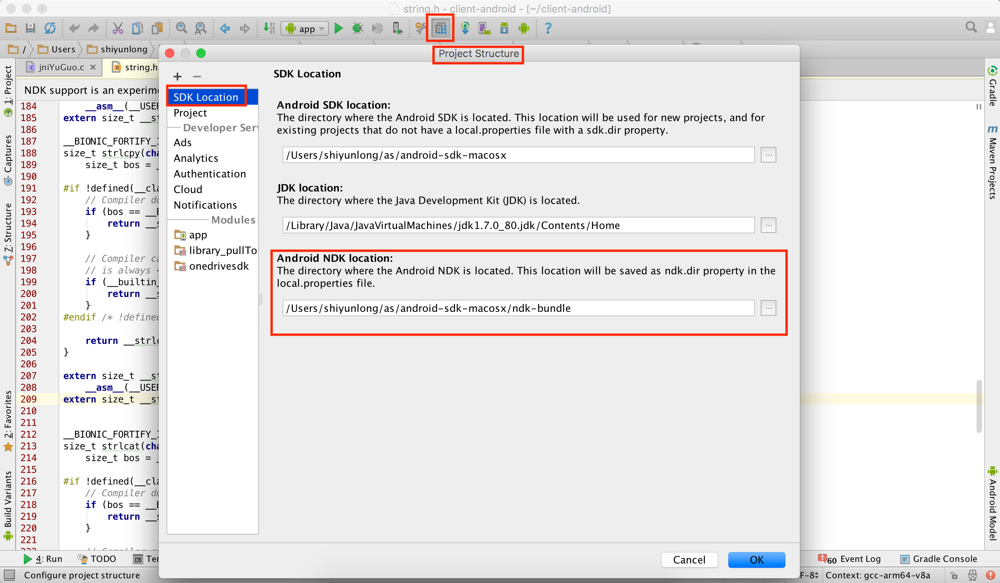

# JNI入门
## 1.下载NDK

1.1. 打开设置->SDKManager。参考下图：

1.2. 下载NDK Bundle。参考下图：

1.3. 设置NDK（Project Structure->SDK Location->Android NDK Location）。参考下图：

## 2. 配置local.properties.
local.properties的路径：工程根目录/local.properties。具体配置信息如下：
	
	ndk.dir=/Users/shiyunlong/as/android-sdk-macosx/ndk-bundle
	sdk.dir=/Users/shiyunlong/as/android-sdk-macosx

1.3设置过后，有可能此处已经配置好。

## 3. 配置build.gradle

	android {
    	...
    	defaultConfig {
        	...
        	ndk {
            	moduleName "jniYuGuo" //JNI的so文件名称
            	ldLibs "log" //在C文件中输出Log日志
        	}
    	}
    	...
    }
   
   至此基础配置已经完成，可以开始写代码了。
 
## 4.界面

Activity：[连接](code/20151222/TestJNIActivity.java)

XML：[连接](code/20151222/a_test_jni.xml)

### 5.C代码
代码应放在project/app/src/main/jni下：

Android.mk：Android 配置文件，[具体代码](code/20151222/Android.mk)

	LOCAL_PATH := $(call my-dir)

	include $(CLEAR_VARS)
	
	#so文件名，同build.gradle中的moduleName，也同Activity中的System.loadLibrary(文件名)中的文件名
	LOCAL_MODULE    := jniYuGuo
	//c语言文件
	LOCAL_SRC_FILES := jniYuGuo.c
	//log日志
	LOCAL_LDLIBS    := -llog

	include $(BUILD_SHARED_LIBRARY)
	
Application.mk：应用的配置文件，[具体代码](code/20151222/Application.mk)
	
	#生成的SO文件的类别，all代表所有
	APP_ABI := all

	#生成的SO文件具体有：arm64-v8a armeabi armeabi-v7a mips mips64 x86 x86_64

“#”后的内容为注释，不要复制。

jniYuGuo.c：C文件，正常如果使用命令行生成，应该是有相应的头文件的，这里可以不用。 
	[代码](code/20151222/jniYuGuo.c)

其实下载的NDK Bundle中是有样例的，具体路径：ndk-bundle/samples，这里面包含c和c++的jni样例。	

------------
说明：基于Mac Android Studio 1.4.1
说明：20151222简略版