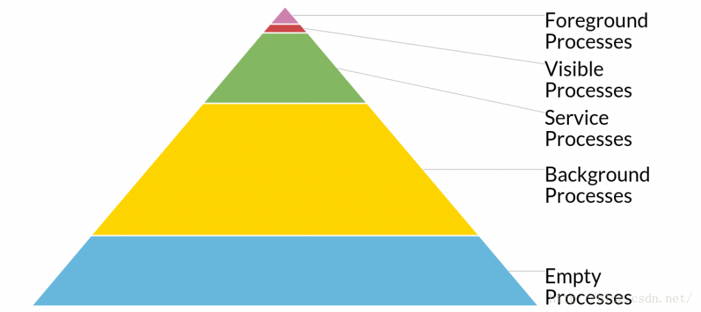

# 基础

## 四大组件

### Activity

#### 1.Activity 的生命周期。

具体生命参考下图


- 正常生命周期

- - onCreate()：该方法是Activity被创建时回调，它是生命周期第一个调用的方法，我们在创建Activity时一般都重写该方法，然后在该方法中做一些初始化的操作，比如通过setContentView设置界面布局的资源，初始化所需要的组件信息。

- - onStart()：此方法被回调时,表示Activity正在启动，此时Activity处于可见状态，只是还没有在前台显示，因此无法与用户进行交互。可以简单理解为Activity已显示，但是肉眼看不见。

- - onResume()：此方法回调时，则说明Activity已在前台可见，可以与用户交互了，这是与onStatr()的显著差异。在onResume方法中也可以进行一些初始化，比如初始化加载在onPause和onStop方法中是释放的资源

- - onPause()：此方法被调用时，表示Activity正在停止，一般情况下onStop方法会紧跟着回调，特殊情况会调用onResume方法，比如Activity在进入后台时，快速又被用户迅速点击。在此方法中可以进行一些资源的释放和数据的保存，但是不能太耗时，否则会影响后续Activity的展示流畅度。

- - onStop()：一般在onPause方法执行完成后执行，表示Activity即将停止或被完全覆盖，此时Activity不可见，仅在后台运行。同时也可在该方法中进行一些资源的释放。

- - onDestroy()：此时Activity正在被销毁，也是生命周期的一个执行的方法，一般我们可以在此方法中做一些回收工作和最终资源的释放。

- - onRestart()：表示Activity正在被重新启动，当Activity由不可见变为可见状态时，该方法被回调，这种情况一般是新开了一个Activity后，又回到该Activity。

- 非正常的生命周期

- - onSaveInstanceState：保存Activity的当前状态，是在onPause方法之后。一般在Activity被异常销毁的时候调用。比如横竖屏切换。它有两个重载方法

- - onRestoreInstanceState：进行数据恢复，对应上一个生命周期，只有被异常销毁时才会调用该生命周期。

- - Android系统会默认保存一部分数据和View状态。其他的数据还是需要自己进行存储。

- - onConfigurationChanged()：因为在横竖屏切换时，可以选择设置参数使Activity不销毁，参数在AndroidManifest中Activity的参数android:configChanges进行设置。在API<13时，值使用orientation，>=13时，还需要额外加入screenSize。此时会调用该生命周期

```
<activity android:name=".MainActivity" android:configchanges="orientation|screenSize">
    <intent-filter>
      <action android:name="android.intent.action.MAIN">
        <category android:name="android.intent.category.LAUNCHER"> </category>
      </action>
    </intent-filter>
</activity>
```

- Activity的状态

- - 活动状态（Active/Running）

当Activity运行在屏幕前台（处于当前活动栈的最上面），此时它获得了焦点能响应用户的操作，属于运行状态,同一时刻只会有一个Activity处于（Active）或者（Running）状态。

此状态由onResume()进入，由onPuse()退出。

- - 暂停状态（Paused）

当Activity失去焦点但仍对用户可见(如在它上面有另一个透明的Activity或者Toast、Dialog等弹出窗口时)它处于暂停状态。暂停状态仍是存活状态（它保留着所有的状态和成员信息并保持和窗口管理器的连接），但是当系统内存极小时可以被系统杀掉。

此状态由onPause()进入，可以下一步进入onRestart()、onResume()、或者onCreate()重新唤醒软件，或者被onStop()杀掉

- - 停止状态（Stopped）

完全被另一个Activity遮挡时处于停止状态，它仍然保留着所有状态和成员信息。只是对用户不可见，当其他地方需要内存时她往往被系统杀掉。

该状态由onStop()进入，如果被杀掉，可能进入onCreate()或者onRestart()，如果彻底死亡，进入onDestroy()

- - 非活动状态（Dead）

在死亡过程中的Activity

#### 2 Activity的四种启动模式对比

- standard，标准模式，每次都新建一个实例对象

什么配置都不写的话就是这种启动模式。

- singleTop 如果在任务栈顶发现了相同的实例则重用，否则新建并压入栈顶

- singleInstance 如果在任务栈中发现了相同的实例，将其上面的任务终止并移除，重用该实例。否则则新建实例并压入栈。

系统创建新任务并实例化位于新任务底部的Activity。但是，如果该 Activity 的一个实例已存在于一个单独的任务中，则系统会通过调用现有实例的 onNewIntent() 方法向其传送 Intent，而不是创建新实例。一次只能存在 Activity 的一个实例。

需要注意的是：重用该实例时，会杀死该实例所在任务栈上方所有实例。

- singleInstance 允许不同应用，进程线程等共用一个实例，无论从何应用调用该实例都重用.

与singleTask相同，只是系统不会将任何其他Activity启动到包含实例的任务中。该Activity始终是其任务唯一仅有的成员；由此Activity启动的Activity均在单独的任务中打开。

参考：[任务和返回栈](https://developer.android.com/guide/components/tasks-and-back-stack.html)

#### 3 startActivityForResult是哪个类的方法，在什么情况下使用，如果在Adapter中使用应该如何解耦；

该方法是Context的方法。

在启动其他的Activity并且需要回调数据时使用。

观察者模式可以解耦，注册监听也可行，发送广播也可以解耦。

#### 4 两个Activity之间跳转必然会执行的是哪几个方法？

两个Activity A和B，从A跳转到B，A会执行的方法是onPause()，然后B会执行的方法是onCreate(), onStart()、onResume()，如果B是不透明的，A还会执行onStop方法，如果B是透明的则不会执行onStop方法。onStop()方法是在B的onResume之后执行。

如果从B返回A，B会依次执行onPause()、onStop()、onDestroy()方法，A会执行onRestart()、onStart()、onResume()方法，如果A启动B时采用的是startActivityForResult方法，则还会执行onActivityResult方法。

方法执行顺序 B onPause A onRestart onStart onResume B onStop onDestroy

如果执行onActivityForResult()方法，则它是A中第一个执行的方法。

#### 5 Activity的状态保存与恢复

主要是处理onSaveInstanceState，onRestoreInstanceState，onConfigurationChanged三个方法。

在进行Activity、Fragment的状态保存与恢复是应尽量避免内存泄露。

[具体参考](http://www.jianshu.com/p/90cf59f22f40)

### BroadcastReceiver

### Service

### ContentProvider

## Android 进程

### Android进程优先级

进程的优先级是指的进程，并非组件。

当一个应用程序第一次启动的时候，Android系统会启动一个Linux进程和一个主线程。默认情况下所有程序的组件都将在该进程和线程中进行。

通过在清单文件中设置android:process来控制组件属于哪些进程。如果开启组件时，该组件所在的进程未创建过，则创建该进程。

创建多进程是为了让不占用主进程的资源，因为每一个进程在手机中内存是有使用限制的，一般为128M,不同的手机厂商可能会产生差异。



- - Foreground Processes（前台进程）：

    前台进程的数量很少，前台进程几乎不会被杀死，只有内存低到无法保证所有前台进程同时运行时，才会选择杀死某些前台进程，此时设备往往已到达内存分页状态，因此需要终止一些前台进程来确保用户界面正常响应。

    以下几种是属于前台进程的分类

    1. 处于前台正与用户交互的Activity
    2. 与前台Activity绑定的Service
    3. 调用startForeground()方法的Service
    4. 正在执行onCreate()，onStart()或者onDestroy方法的Service
    5. 正在执行onReceive()方法的BroadcastReceiver;

- - Visible Processes(可见进程)

    没有任何前台组件、但是会影响用户在屏幕上所见内容的进程。如果一个进程满足以下任一条件，即视为可见进程

    1. 托管不在前台、但仍对用户可见的Activity(已调用onPause)方法，如果启动一个对话框。
    2. 绑定到前台可见Activity的Service

    可见进程被视为及其重要的进程，除非为了维持所有前台进程同时运行而必须终止，否则系统不会终止这些进程。

- - Service Processes(服务进程)

    正在运行已使用 startService() 方法启动的服务且不属于上述两个更高类别进程的进程。尽管服务进程与用户所见内容没有直接关联，但是它们通常在执行一些用户关心的操作（例如，在后台播放音乐或从网络下载数据）。因此，除非内存不足以维持所有前台进程和可见进程同时运行，否则系统会让服务进程保持运行状态。

- - Background Processes(后台进程)

    包含目前对用户不可见的 Activity 的进程（已调用 Activity 的 onStop() 方法）。这些进程对用户体验没有直接影响，系统可能随时终止它们，以回收内存供前台进程、可见进程或服务进程使用。 通常会有很多后台进程在运行，因此它们会保存在 LRU （最近最少使用）列表中，以确保包含用户最近查看的 Activity 的进程最后一个被终止。如果某个 Activity 正确实现了生命周期方法，并保存了其当前状态，则终止其进程不会对用户体验产生明显影响，因为当用户导航回该 Activity 时，Activity 会恢复其所有可见状态。 有关保存和恢复状态的信息，请参阅 Activity文档。

- - Empty Processes(空进程)

    不含任何活动应用组件的进程。保留这种进程的的唯一目的是用作缓存，以缩短下次在其中运行组件所需的启动时间。 为使总体系统资源在进程缓存和底层内核缓存之间保持平衡，系统往往会终止这些进程。

根据进程中当前活动组件的重要程度，Android 会将进程评定为它可能达到的最高级别。例如，如果某进程托管着服务和可见 Activity，则会将此进程评定为可见进程，而不是服务进程。

此外，一个进程的级别可能会因其他进程对它的依赖而有所提高，即服务于另一进程的进程其级别永远不会低于其所服务的进程。 例如，如果进程 A 中的内容提供程序为进程 B 中的客户端提供服务，或者如果进程 A 中的服务绑定到进程 B 中的组件，则进程 A 始终被视为至少与进程 B 同样重要。

由于运行服务的进程其级别高于托管后台 Activity 的进程，因此启动长时间运行操作的 Activity 最好为该操作启动服务，而不是简单地创建工作线程，当操作有可能比 Activity 更加持久时尤要如此。例如，正在将图片上传到网站的 Activity 应该启动服务来执行上传，这样一来，即使用户退出 Activity，仍可在后台继续执行上传操作。使用服务可以保证，无论 Activity 发生什么情况，该操作至少具备"服务进程"优先级。 同理，广播接收器也应使用服务，而不是简单地将耗时冗长的操作放入线程中。

### 内存相关

#### 1 内存泄露

内存中的对象不能正确回收

1. 生命周期相关

  静态的Activity对象，对象持有时间超出了Activity生命周期

  静态的View，超出了依附对象的生命周期。

  静态内部类。

  解决办法：在生命周期销毁时，将对象置空

  单例模式类持有静态context对象。这种一般将单例模式持有的context对象修改为ApplicationContext。

2. 多线程相关

  在子线程中持有父类对象，父类对象销毁时不能正确回收。

  匿名，异步任务，默认持有父类的对象

  匿名，子线程，默认持有父类的对象

  Handler，默认持有父类对象

  TimerTask 时间任务，一般倒计时使用

  解决办法：加入弱引用，弱引用对象在线程回收时可以被正确回收，或者结束时中断子线程。

3. 传感器

  传感器注册监听，该监听持有了Context对象，Context不能正确回收。

  在生命周期结束时结束监听，并置空监听。
