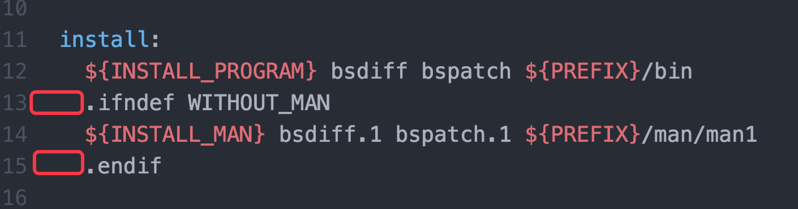

# Android 增量更新

## 一、概述

增量更新步骤

1、生成差分包**针对不同的版本的APK生成相应的差分包（增量文件）**

2、从手机中提取当前的APK

3、将当前APK和差分包，合成生成新的APK，校验MD5，安装。

## 二、增量文件的生成与合并

这个其实就是利用工具做二进制的一个diff和patch.

工具下载网址

<http://www.daemonology.net/bsdiff/>

压缩包

<http://www.daemonology.net/bsdiff/bsdiff-4.3.tar.gz>

下载好后，解压，切到对应的目录，执行"make"，MAC环境测试

直接执行make会出现以下两种错误。

**错误一、Makefile错误**


解决方式:

将makefile文件打开，将install后续代码修改成如下样式，其实就是在下图中的if,endif前加制表符(tab),使上下对齐



**错误二、无法生成bspatch文件**

继续执行make，此时可以正常生成bsdiff文件，但是无法正常生成bspatch文件，同时报一下错误。


解决方式 mac

在bspatch.c文件中引入 "sys/type.h"，直接引入也可

```
# ifdef __APPLE__
# include <sys/types.h>
# endif
```

这样就可以使用相应的命令生成patch包了。

```
./bsdiff old.apk new.apk old-to-new.patch
```

这样就生成了一个增量文件

增量文件和old.apk生成新的apk

```
./bspatch old.apk new2.apk old-to-new.patch
```

校验新生成的APK的MD5值和原来最新的APK的MD5值是否相同。

## 三、客户端

### 3.1提取客户端APK

其实就是获取当前应用的APK安装包

```
public static String extract(Context context) {
    context = context.getApplicationContext();
    ApplicationInfo applicationInfo = context.getApplicationInfo();
    return applicationInfo.sourceDir;
}
```

### 3.2下载Patch。

将生成的对应补丁下载到本地。针对不同版本的APK获取相应的补丁包下载到本地，

同时需要获得最新包APK的MD5值。

### 3.3客户端APK和Patch合成新的APK

合成APK是需要用到bspatch的文件，但是该文件是bspatch.c生成的可执行文件，所以需要使用JNI引入C语言编译生成so文件，然后使用so文件合并APK

#### 3.3.1 生成so文件

需要首先配置ndk环境。

如下图，


在app/main目录下新建一个文件夹jni，把bspatch.c文件放置到到该文件夹下。

写java可调用方法

该方法的主要作用是调用c中的Main方法。但是c文件执行过程中不能直接该有main方法，main方法改名为patchMethod

```
JNIEXPORT jint JNICALL Java_com_yunlong_samples_incremental_BsPatch_bspatch
        (JNIEnv *env, jclass cls,
         jstring old, jstring new, jstring patch){
    int argc = 4;
    char * argv[argc];
    argv[0] = "bspatch";
    argv[1] = (char*) ((*env)->GetStringUTFChars(env, old, 0));
    argv[2] = (char*) ((*env)->GetStringUTFChars(env, new, 0));
    argv[3] = (char*) ((*env)->GetStringUTFChars(env, patch, 0));


    int ret = patchMethod(argc, argv);

    (*env)->ReleaseStringUTFChars(env, old, argv[1]);
    (*env)->ReleaseStringUTFChars(env, new, argv[2]);
    (*env)->ReleaseStringUTFChars(env, patch, argv[3]);
    return ret;
}
```

在java中配置可调用c方法的native方法

```
public class BsPatch {

    static {
        System.loadLibrary("bspatch");
    }

    public static native int bspatch(String oldApk, String newApk, String patch);

}
```

配置build.gradle

```
    defaultConfig {
        ndk {
            moduleName = 'bspatch'
        }
    }
```

注意：**moduleName需要和System.loadLibrary中的名字完全一致。**

在bspatch.c中引入多个依赖，如下

```
#include "jni.h"

#include "bzip2/bzlib.h"
```

bzlib的下载路径

<http://www.bzip.org/downloads.html>

<http://www.bzip.org/1.0.6/bzip2-1.0.6.tar.gz>

压缩包解压后将.h和.c的文件提取出来，放置到jni中，建议放置在单独文件夹中(bzip2)。

**此时运行时会依然会报如下错误，**

```
Error:(70) multiple definition of``main'
```

解决方式：将bzip2中所有的main方法注释或删除即可。

#### 3.3.2 和patch生成APK

在相应位置调用以下方法即可，需要注意的是需要检查文件是否存在。

```
    /**
     * 开始合成新的apk包
     */
    public void bsPatch() {
        if (checkFile()) {
            String newAPKFilePath = Environment.getExternalStorageDirectory() + File.separator + FILE_PACKAGE + File.separator + NEW_APK_FILE_NAME;
            String patchFilePath = Environment.getExternalStorageDirectory() + File.separator + FILE_PACKAGE + File.separator + PATCH_FILE_NAME;
            BsPatch.bspatch(ApkExtract.extract(this), newAPKFilePath, patchFilePath);
        }
    }

    /**
     * 检查文件是否存在
     */
    public boolean checkFile() {
        if (Environment.getExternalStorageState().equals(Environment.MEDIA_MOUNTED)) {
            File filePackage = new File(FILE_PACKAGE);
            if (!filePackage.exists())
                filePackage.mkdirs();
            File oldAPKFile = new File(ApkExtract.extract(this));
            File newAPKFile = new File(Environment.getExternalStorageDirectory() + File.separator + FILE_PACKAGE + File.separator + NEW_APK_FILE_NAME);
            if (!newAPKFile.exists()) {
                try {
                    newAPKFile.createNewFile();
                } catch (IOException e) {
                    e.printStackTrace();
                }
            }

            File patchFile = new File(Environment.getExternalStorageDirectory() + File.separator + FILE_PACKAGE + File.separator + PATCH_FILE_NAME);
            return oldAPKFile.exists() && newAPKFile.exists() && patchFile.exists();
        }
        return false;
    }
```

#### 3.3.3 校验和安装APK

**检查新生成的APK是否存在**

**检查生成APK的MD5值和3.2中的MD5值是否一致**

**检查一致后，安装apk**

## 四、总结

java源码：<https://github.com/yunlonggmail/samples/tree/develop/app/src/main/java/com/yunlong/samples/incremental>

jni源码:

<https://github.com/yunlonggmail/samples/tree/develop/app/src/main/jni>

[用到的压缩文件](file)

说明：

摘抄自：[Android 增量更新完全解析](http://gold.xitu.io/post/57fba92abf22ec00649de645)
