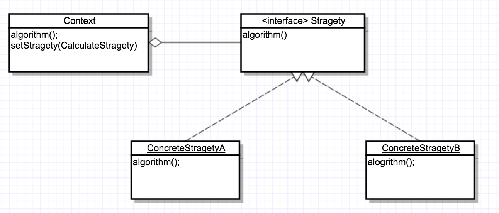

# 7.1策略模式介绍

实现某一功能需要用到不同的算法(对象执行不同行为)，那么如果将所有行为封装到对象中，并让对象选择，那么如果行为出现改变，会导致代码的修改量无限扩大。

为了更好更安全的维护相应对象，那么就需要将行为进行抽象，然后告诉对象执行不同的行为即可。

## 7.2 策略模式的定义

策略模式定义了一系列算法，并将每一个算法封装起来，而且使他们还可以相互替换。策略模式让算法独立于使用它的客户而独立变化。

策略模式是一种对象行为型模式

## 7.3 策略模式使用场景

1. 针对同一类型问题的多种处理方式，仅仅是具体行为有差别时。
2. 需要安全地封装多种同一类型的操作时。
3. 出现同一类抽象有多个子类，而有需要使用if-else 或 switch-case 来选择具体子类时。

## 7.4 策略模式的UML类图

1. Context--用来操作策略的上下文环境。
2. Stragety--策略的抽象
3. ConcreteStragetyA、ConcreteStragetyB--具体的策略实现。

## 7.5 策略模式的简单实现

## 7.6 Android 源码中的策略模式实现

### 7.6.1 时间差值器

计算动画运行时间百分比= 当前时间-（开始时间+时间偏移量）/时长。值：[0.0f,1.0f]

类型估值器：根据时间差值器估出当时View的属性值。

## 7.6.2 动画中的时间差值器

1. View调用StartAnimation方法，开始动画。
2. View重绘，调用View.onDraw方法。
3. onDraw方法中，调用View.drawAnimation方法，进行动画的初始化，操作界面刷新等，drawAnimation方法的返回值是动画是否过期，也就是动画是否在执行。
4. drawAnimation中调用Animation.getTransformation方法，该方法中就调用差值器进行动画执行时间百分比重设。而不同的差值器就是采用策略模式定义。根据差值器提供的百分比结果来进行View的计算。
