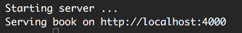

# GitBook的安装

## 1、安装Node.js

### 1.1第一种安装方式：使用终端命令

	nvm install 5.0.0
	
	如果出现ERROR之类的错误。
	
	sudo nvm install 5.0.0
	
### 1.2第二种安装方式：使用压缩包安装。
下载链接：[Node.js](https://nodejs.org/en/)

建议安装4.0以上版本。

### 1.3安装完成后
	
使用如下命令行检查：
	
	node -v

## 2、安装GitBook

使用如下命令行

	npm install gitbook-cli -g
	
出现错误加入sudo
	
	sudo npm install gitbook-cli -g
	
## 3、clone git 工程。

	切换到对应文件夹
	git clone 工程的ssh命令。
	
## 4、启动gitbook服务
	
	切换到文档工程目录。
	
	cd {{path}}
	
	gitbook serve
	
## 5、浏览器中输入最后给出的连接即可。
如下图：

	