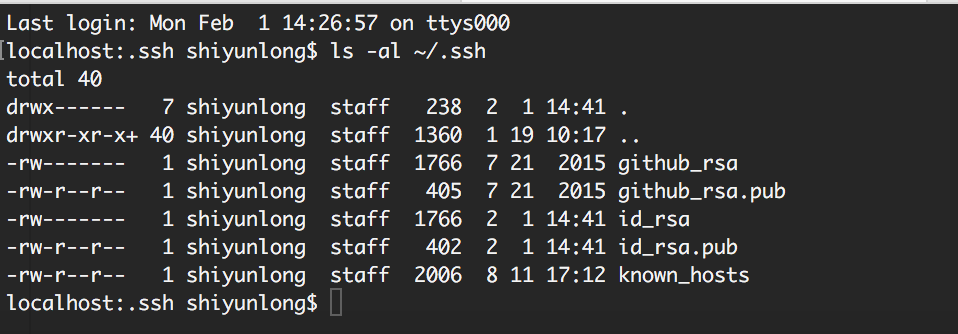
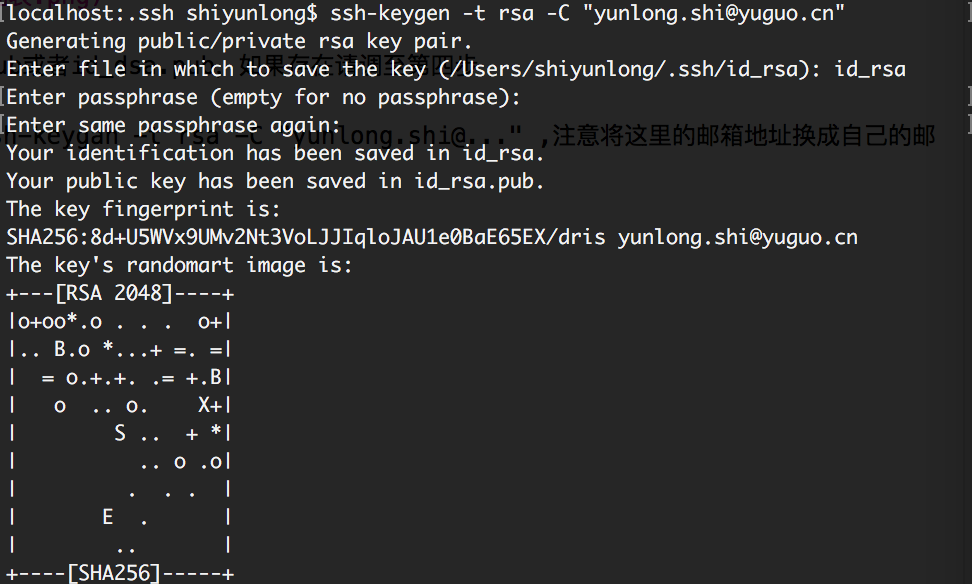
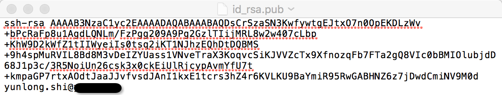
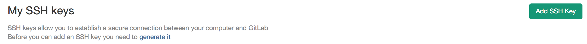
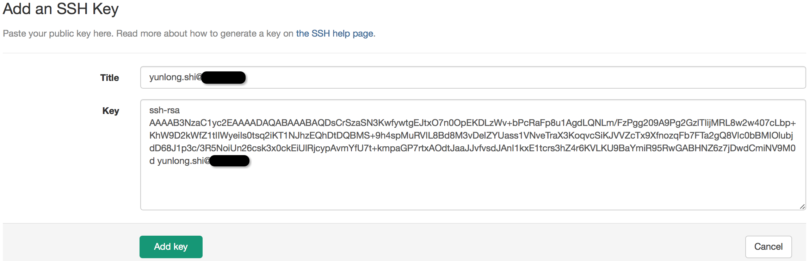

# 添加SSH key

1、切换到~/.ssh

2、打开git bash, 输入命令 ls -al ~/.ssh

检查是否显示有id_rsa.pub或者id_dsa.pub，如果存在请调至第四步

3、在git bash中键入 ssh-keygan -t rsa -C "yunlong.shi@..." ,注意将这里的邮箱地址换成自己的邮箱地址。

注意这里会提示让你输入文件名字和密码，就是id_rsa的名称。

最后把密码记一下，别输完就忘了。

4、用记事本之类的软件打开id_rsa.pub文件，并且复制全部内容。

5、在你的gitlab或者github的账户，打开SSH key标签。

6、然后选择Add SSH key按钮，将刚刚复制的内容粘贴进去即可，然后点击add key。

